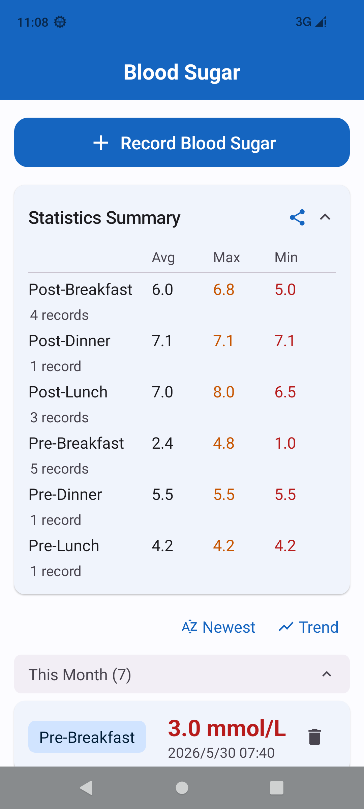
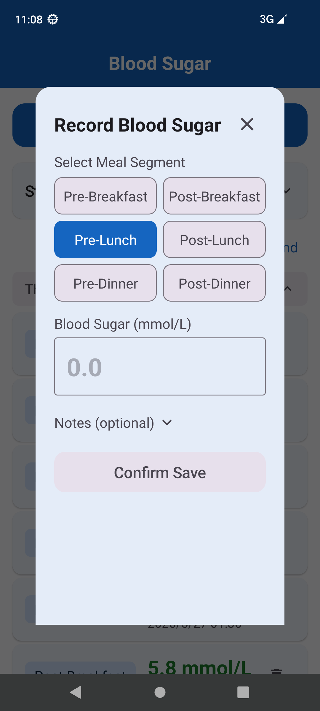
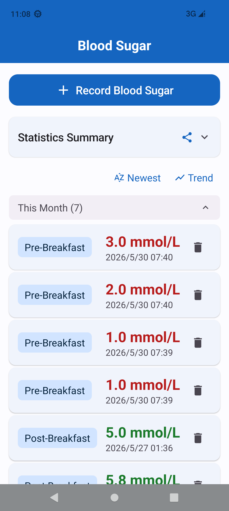
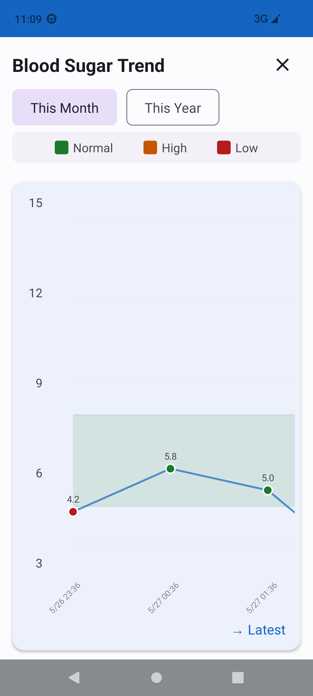

# 血糖管家 — BloodSugar Tracker

[English Version](README.md)

> 奶奶有糖尿病，每天在手抄本上记录血糖值，但本子越来越厚，找某天的记录很困难，每次看诊都要翻半天。我帮她做了这个血糖管家 app，记录更方便，还能一键生成 PDF 报告给医生看。

一个轻量级 Android 血糖记录应用，专为老年人设计。Kotlin + Jetpack Compose + Material 3。

## 功能

- **快速记录**：6 个餐段（早餐前/后、午餐前/后、晚餐前/后），时间自动推断
- **统计摘要**：按餐段分组显示平均值、最高、最低、记录数
- **PDF 导出**：一键生成血糖报告，支持微信/蓝牙/打印分享给医生
- **趋势图**：Canvas 自绘折线图，支持月/年切换，横向滚动
- **时间分组**：本月 / 今年 / 更早，可折叠，空分组隐藏
- **排序**：最新优先 / 最旧优先切换
- **中英双语**：跟随系统语言自动切换
- **颜色编码**：偏低红、正常绿、偏高橙，WCAG AA 无障碍标准
- **数据安全**：Room 数据库 + Migration 框架，覆盖安装不丢数据
- **隐私**：完全离线，不收集任何数据

## 截图

| 主界面 | 记录弹窗 | 统计摘要 | 趋势图 |
|:------:|:--------:|:--------:|:--------:|
|  |  |  |  |

## 技术栈

| 组件 | 版本 | 说明 |
|------|------|------|
| AGP | 7.4.2 | 兼容 JDK 11 |
| Kotlin | 1.8.22 | Compose Compiler 1.4.8 |
| JDK | 11 | Eclipse Adoptium |
| Compose BOM | 2023.06.01 | |
| Room | 2.5.2 | 使用 kapt |

**零第三方依赖** — PDF 生成使用 Android 原生 `PdfDocument` API，图表使用 Compose `Canvas` 绘制，无图表库、无 PDF 库。

## 架构

```
app/src/main/java/com/bloodsugar/
├── MainActivity.kt          # 入口
├── data/
│   ├── AppDatabase.kt       # Room 数据库（含 Migration 框架）
│   ├── Record.kt            # 实体：id, value, segment, note, timestamp
│   ├── RecordDao.kt         # DAO：Flow 查询 + SQL 聚合统计
│   └── SegmentStats.kt      # 统计数据类
├── ui/
│   ├── MainScreen.kt        # 主界面：标题栏 + 统计卡片 + 分组记录列表
│   ├── MainViewModel.kt     # 状态管理（MVVM）
│   ├── RecordSheet.kt       # 新建/编辑弹窗
│   ├── ChartOverlay.kt      # 趋势图（Canvas 自绘）
│   ├── StatsSummaryCard.kt  # 统计摘要卡片（可折叠）
│   ├── PdfExporter.kt       # PDF 报告生成（零依赖）
│   └── theme/               # 颜色、字体、Material 3 主题
└── util/
    ├── GlucoseValidator.kt  # 血糖值校验（1.0-33.3 mmol/L）
    └── MealSegment.kt       # 6 个餐段枚举 + 时间推断
```

- **MVVM** — ViewModel 直接调用 DAO（无 Repository 层、无依赖注入）
- **Jetpack Compose** — 100% 声明式 UI
- **Material 3** — 设计系统，支持亮色/暗色主题
- **StateFlow** — 响应式状态管理

## 编译

```bash
# 设置 JAVA_HOME（根据你的系统调整路径）
export JAVA_HOME="/path/to/jdk-11"

# 编译调试 APK
./gradlew assembleDebug

# 输出：app/build/outputs/apk/debug/app-debug.apk
```

## 安装

1. 从[ Releases ](../../releases)下载 APK，或从源码编译
2. 在安卓设备上开启「允许安装未知来源应用」
3. 安装 APK

## 添加新语言

1. 创建 `app/src/main/res/values-<locale>/strings.xml`
2. 复制 `app/src/main/res/values/strings.xml`（中文）或 `values-en/strings.xml`（英文）中的所有条目
3. 翻译内容

## 数据安全

- **不使用 `fallbackToDestructiveMigration()`** — 更新永远不会删除你的数据
- 覆盖安装 APK 保留所有已有记录
- 数据库结构变更使用 Room 的 `Migration` 框架，附带 SQL 脚本

## 贡献

欢迎贡献代码！欢迎提交 Issue 或 Pull Request。

## 开源协议

[MIT 协议](LICENSE) — 自由使用、修改和分发。

## 为什么做这个

糖尿病管理需要持续记录，但现有应用往往臃肿、带广告、或要求注册云账号。这个应用：

- **极简操作** — 为觉得智能手机复杂的人群设计
- **完全离线** — 无需账号、无需云端、不追踪数据
- **零成本** — 无广告、无订阅、无付费墙
- **可分享** — 一键导出 PDF，方便看诊时给医生

为最需要它的人用心打造。
